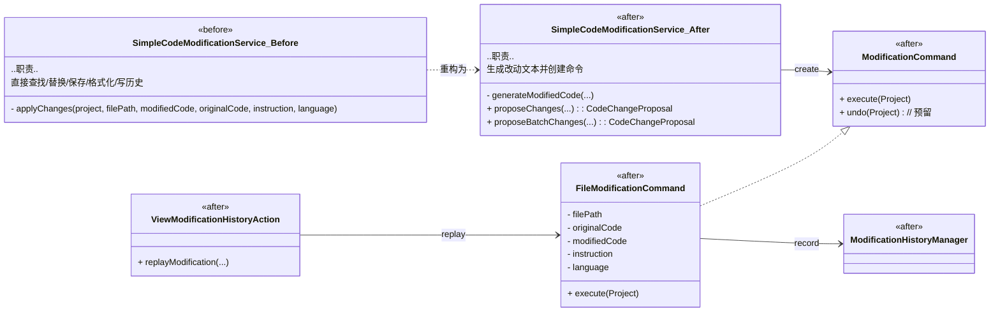
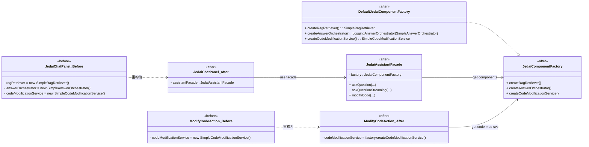

# Command / Factory 重构说明（中文版）

本文件聚焦本次重构中与 **命令模式（Command）** 与 **工厂模式（Factory）** 相关的改动、差异、UML 以及 AI 使用说明，便于课程验收与展示。

## 1. 涉及模式与范围
- 命令模式：代码修改流程（生成改动 → 封装命令 → 执行/重放）。
- 工厂模式：核心组件的创建与装配（RAG、问答编排器、代码修改服务）。

## 2. 代码改动与标注（均已在代码中用“使用XXX模式重构”注明）
- 命令模式
  - `mod/ModificationCommand.java`（抽象命令接口）
  - `mod/impl/FileModificationCommand.java`（具体命令，实现实际文件修改与历史记录）
  - `mod/impl/SimpleCodeModificationService.java`（生成修改→创建命令→执行）
  - `actions/ViewModificationHistoryAction.java`（历史重放复用命令执行）
- 工厂模式
  - `JedaiComponentFactory.java`（组件工厂接口）
  - `impl/DefaultJedaiComponentFactory.java`（默认工厂实现 + 日志装饰器装配）
  - `JedaiAssistantFacade.java`（Facade 内部通过工厂拿到组件）
  - `actions/ModifyCodeAction.java`（通过工厂获取代码修改服务，而非直接 new）

## 3. 重构前后主要差异
- 命令模式（Command）
  - **重构前（JEDAI-main）**：`SimpleCodeModificationService.applyChanges()` 直接完成查找文件、替换、保存、格式化、记录历史，职责集中且难以复用/批量/重放。
  - **重构后（JEDAI-design_pattern_try）**：`SimpleCodeModificationService` 只生成改动与命令对象；`FileModificationCommand.execute()` 负责实际写入与历史记录；历史重放也复用同一个命令实现。职责解耦、便于批量执行与未来的撤销/重放。
  - **已标注**：相关类/关键位置均添加“使用命令模式重构”注释。
- 工厂模式（Factory）
  - **重构前（JEDAI-main）**：`JedaiChatPanel`、`ModifyCodeAction` 直接 `new SimpleRagRetriever / SimpleAnswerOrchestrator / SimpleCodeModificationService`，UI 与具体实现强耦合。
  - **重构后（JEDAI-design_pattern_try）**：通过 `JedaiComponentFactory` + `DefaultJedaiComponentFactory` 统一创建组件，`JedaiAssistantFacade` 和 Action 仅依赖工厂/接口，便于切换实现（不同 LLM、不同 RAG、测试桩等）。
  - **已标注**：相关类已添加“使用工厂模式重构”说明。

## 4. UML（PlantUML）

### 4.1 命令模式（重构前后对比，Mermaid UML 类图）

### 4.2 工厂模式（重构前后对比，Mermaid UML 类图）

## 5. 修改原因与收益
- 职责分离：生成改动与应用改动解耦，易于批量/重放/未来扩展撤销。
- 可替换性：UI 仅依赖接口/工厂，后续替换 LLM、RAG 或增加装饰器无需改 UI。
- 可测试性：命令对象易于单测/桩替换；工厂便于注入 Mock 实现。

## 6. AI 工具使用说明
- 使用 LLM 辅助梳理“命令模式 vs. 直接调用”设计权衡、生成接口骨架，再结合 IntelliJ SDK 约束（EDT、WriteCommandAction）人工校对。
- 最佳实践：先定义接口/职责，再让 LLM 生成骨架；涉及 IDE 写操作须人工确认线程与持久化逻辑。
- 局限与挑战：LLM 对 IntelliJ API 细节掌握有限，格式化/历史记录逻辑需本地验证；批量执行时需确保 Project 上下文传递正确（已在命令执行时接收 project）。
- 经验教训：把“副作用”封装成命令对象后，历史重放、批量应用、未来的撤销都可以在同一抽象层实现，减少重复代码。

## 7. 后续检查建议
- 回归验证：在 IDE 中执行“Modify Code with JEDAI”、“View Modification History → Replay”确认命令执行正常。
- 若后续支持撤销/重放队列，可在 `ModificationCommand.undo` 中实现逆操作，并由历史列表统一调度。

