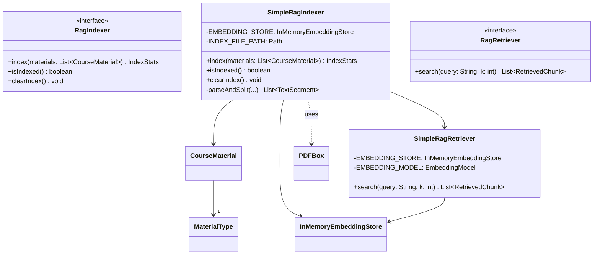
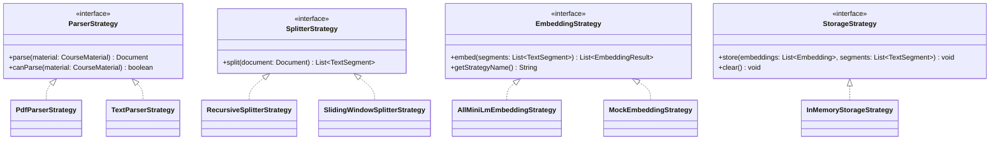
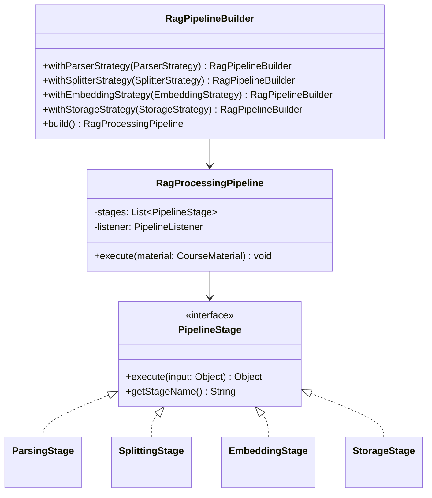

# RAG Module Refactoring — Pipeline + Strategy

I analyzed the original RAG module and refactored it to separate concerns, make processing stages configurable, and make algorithms swappable at runtime. This document summarizes the change: directory structure, important code snippets, class diagrams (Mermaid), and explanations. Read through the diagrams and examples to understand how the new design improves extensibility, testability and maintainability.

---

## Directory Structure

```
src/main/java/com/github/ericufo/jedai/rag/
├── CourseMaterial.java
├── IndexStats.java
├── RetrievedChunk.java
├── RagIndexer.java
├── RagRetriever.java
│
├── strategy/
│   ├── ParserStrategy.java
│   ├── SplitterStrategy.java
│   ├── EmbeddingStrategy.java
│   ├── StorageStrategy.java
│   ├── EmbeddingResult.java
│   ├── ParsingException.java
│   ├── SplittingException.java
│   ├── EmbeddingException.java
│   ├── StorageException.java
│   └── impl/
│       ├── PdfParserStrategy.java
│       ├── TextParserStrategy.java
│       ├── RecursiveSplitterStrategy.java
│       ├── SlidingWindowSplitterStrategy.java
│       ├── AllMiniLmEmbeddingStrategy.java
│       ├── MockEmbeddingStrategy.java
│       └── InMemoryStorageStrategy.java
│   └── selector/
│       └── StrategySelector.java
│
├── pipeline/
│   ├── PipelineStage.java
│   ├── RagProcessingPipeline.java
│   ├── RagPipelineBuilder.java
│   ├── PipelineListener.java
│   ├── PipelineException.java
│   └── stages/
│       ├── ParsingStage.java
│       ├── SplittingStage.java
│       ├── EmbeddingStage.java
│       └── StorageStage.java
│
└── impl/
    ├── SimpleRagIndexer.java
    ├── SimpleRagRetriever.java
    └── RagIndexerStartupActivity.java
```

---

## Quick Narrative and Rationale

- What I did: separated the original monolithic indexer into a modular pipeline and introduced strategies for algorithmic variability. The pipeline orchestrates stages (parse → split → embed → store). Each stage delegates to a Strategy so you can plug different parsers, splitters, embedding models, or storage backends without changing orchestration code.
- Why: reduces coupling, improves single responsibility, and makes it trivial to add support for new file formats, new embedding models, or new storage backends.
- What to show next: diagrams for "before" and "after", followed by representative code snippets and usage.

---

## Class Diagram — Before Refactor



Shortcomings: parsing, splitting, embedding and storing are implemented in one class with hard-coded model and storage — hard to extend or test.

---

## Class Diagram — After Refactor (Strategy)

We isolate algorithmic choices into strategies:



Key: `StrategySelector` exists to choose strategies (by material type or name) — you can register new strategies at runtime.

---

## Class Diagram — After Refactor (Pipeline)

The pipeline orchestrates stages and provides listener hooks:



Flow: client builds a pipeline by providing strategies (or uses defaults), then calls pipeline.execute(material) for each material.

---

## Representative Code Snippets

Below are representative interfaces and important components. These are concise to illustrate shape and usage.

### Domain & Interfaces

```java
// CourseMaterial.java (domain)
package com.github.ericufo.jedai.rag;
import java.io.File;
public class CourseMaterial {
    private final File file;
    private final MaterialType type;
    public CourseMaterial(File file, MaterialType type) { this.file = file; this.type = type; }
    public File getFile() { return file; }
    public MaterialType getType() { return type; }
    public enum MaterialType { PDF, TEXT }
}
```

```java
// RetrievedChunk.java (domain)
package com.github.ericufo.jedai.rag;
public class RetrievedChunk {
    private final String content;
    private final String sourceDoc;
    private final Integer page;
    private final double score;
    public RetrievedChunk(String content, String sourceDoc, Integer page, double score) {
        this.content = content; this.sourceDoc = sourceDoc; this.page = page; this.score = score;
    }
    // getters ...
}
```

```java
// RagIndexer.java
package com.github.ericufo.jedai.rag;
import java.util.List;
public interface RagIndexer {
    IndexStats index(List<CourseMaterial> materials);
    boolean isIndexed();
    void clearIndex();
}
```

```java
// RagRetriever.java
package com.github.ericufo.jedai.rag;
import java.util.List;
public interface RagRetriever {
    List<RetrievedChunk> search(String query, int k);
    default List<RetrievedChunk> search(String q) { return search(q,5); }
}
```

---

### Strategy Interfaces

```java
// ParserStrategy.java
package com.github.ericufo.jedai.rag.strategy;
import com.github.ericufo.jedai.rag.CourseMaterial;
import dev.langchain4j.data.document.Document;
public interface ParserStrategy {
    Document parse(CourseMaterial material) throws ParsingException;
    boolean canParse(CourseMaterial material);
    String getStrategyName();
}
```

```java
// SplitterStrategy.java
package com.github.ericufo.jedai.rag.strategy;
import dev.langchain4j.data.document.Document;
import dev.langchain4j.data.segment.TextSegment;
import java.util.List;
public interface SplitterStrategy {
    List<TextSegment> split(Document document) throws SplittingException;
    String getStrategyName();
}
```

```java
// EmbeddingStrategy.java
package com.github.ericufo.jedai.rag.strategy;
import dev.langchain4j.data.segment.TextSegment;
import java.util.List;
public interface EmbeddingStrategy {
    List<EmbeddingResult> embed(List<TextSegment> segments) throws EmbeddingException;
    String getStrategyName();
    int getEmbeddingDimension();
}
```

```java
// StorageStrategy.java
package com.github.ericufo.jedai.rag.strategy;
import dev.langchain4j.data.embedding.Embedding;
import dev.langchain4j.data.segment.TextSegment;
import java.util.List;
public interface StorageStrategy {
    void store(List<Embedding> embeddings, List<TextSegment> segments) throws StorageException;
    void clear() throws StorageException;
    int getStorageSize();
    String getStrategyName();
}
```

```java
// EmbeddingResult.java
package com.github.ericufo.jedai.rag.strategy;
import dev.langchain4j.data.embedding.Embedding;
import dev.langchain4j.data.segment.TextSegment;
public class EmbeddingResult {
    private final Embedding embedding;
    private final TextSegment segment;
    public EmbeddingResult(Embedding e, TextSegment s){ this.embedding=e; this.segment=s; }
    public Embedding getEmbedding(){return embedding;}
    public TextSegment getSegment(){return segment;}
}
```

---

### Example Concrete Strategies (shortened)

```java
// PdfParserStrategy.java (impl)
package com.github.ericufo.jedai.rag.strategy.impl;
import com.github.ericufo.jedai.rag.CourseMaterial;
import com.github.ericufo.jedai.rag.strategy.ParserStrategy;
import dev.langchain4j.data.document.Document;
import org.apache.pdfbox.pdmodel.PDDocument;
import org.apache.pdfbox.text.PDFTextStripper;
public class PdfParserStrategy implements ParserStrategy {
    public Document parse(CourseMaterial material) { /* use PDFBox to create Document */ return new Document("..."); }
    public boolean canParse(CourseMaterial m) { return m.getType()==CourseMaterial.MaterialType.PDF; }
    public String getStrategyName(){ return "PdfParser"; }
}
```

```java
// AllMiniLmEmbeddingStrategy.java (impl)
package com.github.ericufo.jedai.rag.strategy.impl;
import com.github.ericufo.jedai.rag.strategy.EmbeddingStrategy;
import com.github.ericufo.jedai.rag.strategy.EmbeddingResult;
import dev.langchain4j.data.segment.TextSegment;
import dev.langchain4j.model.embedding.EmbeddingModel;
import dev.langchain4j.model.embedding.onnx.allminilml6v2q.AllMiniLmL6V2QuantizedEmbeddingModel;
import java.util.ArrayList;
import java.util.List;
public class AllMiniLmEmbeddingStrategy implements EmbeddingStrategy {
    private final EmbeddingModel model = new AllMiniLmL6V2QuantizedEmbeddingModel();
    public List<EmbeddingResult> embed(List<TextSegment> segments) {
        var embeddings = model.embedAll(segments).content();
        List<EmbeddingResult> out = new ArrayList<>();
        for (int i=0;i<embeddings.size();i++) out.add(new EmbeddingResult(embeddings.get(i), segments.get(i)));
        return out;
    }
    public String getStrategyName(){ return "AllMiniLm"; }
    public int getEmbeddingDimension(){ return 384; }
}
```

```java
// InMemoryStorageStrategy.java (impl)
package com.github.ericufo.jedai.rag.strategy.impl;
import com.github.ericufo.jedai.rag.strategy.StorageStrategy;
import dev.langchain4j.store.embedding.inmemory.InMemoryEmbeddingStore;
import dev.langchain4j.data.segment.TextSegment;
import dev.langchain4j.data.embedding.Embedding;
import java.util.List;
public class InMemoryStorageStrategy implements StorageStrategy {
    private final InMemoryEmbeddingStore<TextSegment> store = new InMemoryEmbeddingStore<>();
    public void store(List<Embedding> embeddings, List<TextSegment> segments) {
        store.addAll(embeddings, segments);
    }
    public void clear(){ store.removeAll(); }
    public int getStorageSize(){ return 0; /* use store API to return size */ }
    public String getStrategyName(){ return "InMemoryStorage"; }
}
```

---

### Pipeline Interfaces & Stages

```java
// PipelineStage.java
package com.github.ericufo.jedai.rag.pipeline;
public interface PipelineStage<I,O>{
    O execute(I input) throws PipelineException;
    String getStageName();
}
```

```java
// ParsingStage.java (injects ParserStrategy)
package com.github.ericufo.jedai.rag.pipeline.stages;
import com.github.ericufo.jedai.rag.CourseMaterial;
import com.github.ericufo.jedai.rag.pipeline.PipelineStage;
import com.github.ericufo.jedai.rag.strategy.ParserStrategy;
import dev.langchain4j.data.document.Document;
public class ParsingStage implements PipelineStage<CourseMaterial, Document> {
    private final ParserStrategy parser;
    public ParsingStage(ParserStrategy parser){ this.parser=parser; }
    public Document execute(CourseMaterial m) throws PipelineException { 
        try { return parser.parse(m); } catch(Exception e){ throw new PipelineException(e); } 
    }
    public String getStageName(){ return "ParsingStage("+parser.getStrategyName()+")"; }
}
```

```java
// EmbeddingStage.java (injects EmbeddingStrategy)
package com.github.ericufo.jedai.rag.pipeline.stages;
import com.github.ericufo.jedai.rag.pipeline.PipelineStage;
import com.github.ericufo.jedai.rag.strategy.EmbeddingStrategy;
import com.github.ericufo.jedai.rag.strategy.EmbeddingResult;
import dev.langchain4j.data.segment.TextSegment;
import java.util.List;
public class EmbeddingStage implements PipelineStage<List<TextSegment>, List<EmbeddingResult>> {
    private final EmbeddingStrategy embedding;
    public EmbeddingStage(EmbeddingStrategy embedding){ this.embedding = embedding; }
    public List<EmbeddingResult> execute(List<TextSegment> in) throws PipelineException {
        try { return embedding.embed(in); } catch(Exception e){ throw new PipelineException(e); }
    }
    public String getStageName(){ return "EmbeddingStage("+embedding.getStrategyName()+")"; }
}
```

```java
// StorageStage.java (injects StorageStrategy)
package com.github.ericufo.jedai.rag.pipeline.stages;
import com.github.ericufo.jedai.rag.pipeline.PipelineStage;
import com.github.ericufo.jedai.rag.strategy.StorageStrategy;
import com.github.ericufo.jedai.rag.strategy.EmbeddingResult;
import dev.langchain4j.data.embedding.Embedding;
import dev.langchain4j.data.segment.TextSegment;
import java.util.ArrayList;
import java.util.List;
public class StorageStage implements PipelineStage<List<EmbeddingResult>, Void> {
    private final StorageStrategy storage;
    public StorageStage(StorageStrategy storage){ this.storage = storage; }
    public Void execute(List<EmbeddingResult> results) throws PipelineException {
        List<Embedding> embeddings = new ArrayList<>();
        List<TextSegment> segments = new ArrayList<>();
        for (var r : results){ embeddings.add(r.getEmbedding()); segments.add(r.getSegment()); }
        try { storage.store(embeddings, segments); return null; } catch(Exception e){ throw new PipelineException(e); }
    }
    public String getStageName(){ return "StorageStage("+storage.getStrategyName()+")"; }
}
```

---

### Pipeline Orchestrator & Builder

```java
// RagProcessingPipeline.java (core)
package com.github.ericufo.jedai.rag.pipeline;
import java.util.List;
public class RagProcessingPipeline {
    private final List<PipelineStage<?, ?>> stages;
    private PipelineListener listener;
    public RagProcessingPipeline(List<PipelineStage<?,?>> stages){ this.stages = stages; }
    public void setListener(PipelineListener l){ this.listener = l; }
    public void execute(CourseMaterial material) throws PipelineException {
        Object current = material;
        for (PipelineStage<?,?> stage : stages) {
            // cast, execute and propagate results; notify listener
            // omitted: type-safe casting and error handling for brevity
        }
    }
}
```

```java
// RagPipelineBuilder.java (fluent)
package com.github.ericufo.jedai.rag.pipeline;
public class RagPipelineBuilder {
    // fields: parserStrategy, splitterStrategy, embeddingStrategy, storageStrategy
    // fluent setters: withParserStrategy(...), ...
    // build(): validate config and create RagProcessingPipeline with stages
}
```

---

### SimpleRagIndexer (orchestration, shortened)

```java
// SimpleRagIndexer.java (refactored)
package com.github.ericufo.jedai.rag.impl;
import com.github.ericufo.jedai.rag.*;
import com.github.ericufo.jedai.rag.pipeline.*;
import com.github.ericufo.jedai.rag.strategy.selector.StrategySelector;
import java.util.List;

public class SimpleRagIndexer implements RagIndexer, PipelineListener {
    private final StrategySelector selector = new StrategySelector();

    public IndexStats index(List<CourseMaterial> materials) {
        int totalChunks = 0;
        for (var material : materials) {
            var parser = selector.selectParser(material);
            var splitter = selector.selectSplitter("recursive");
            var embedding = selector.selectEmbedding("allminilm");
            var storage = selector.selectStorage("inmemory");

            var pipeline = new RagPipelineBuilder()
                            .withParserStrategy(parser)
                            .withSplitterStrategy(splitter)
                            .withEmbeddingStrategy(embedding)
                            .withStorageStrategy(storage)
                            .withListener(this)
                            .build();

            try { pipeline.execute(material); }
            catch (PipelineException e) { /* log and continue */ }
        }
        return new IndexStats(materials.size(), totalChunks, /* elapsed ms */ 0);
    }

    // PipelineListener callbacks ...
}
```

---

### SimpleRagRetriever (shortened)

```java
// SimpleRagRetriever.java (refactored)
package com.github.ericufo.jedai.rag.impl;
import com.github.ericufo.jedai.rag.*;
import com.github.ericufo.jedai.rag.strategy.EmbeddingStrategy;
import com.github.ericufo.jedai.rag.strategy.EmbeddingResult;
import dev.langchain4j.store.embedding.EmbeddingStore;
import dev.langchain4j.data.segment.TextSegment;
import java.util.ArrayList;
import java.util.List;

public class SimpleRagRetriever implements RagRetriever {
    private final EmbeddingStore<TextSegment> store;
    private final EmbeddingStrategy embeddingStrategy;
    private final double threshold;

    public SimpleRagRetriever(EmbeddingStore<TextSegment> store, EmbeddingStrategy embeddingStrategy, double threshold) {
        this.store = store; this.embeddingStrategy = embeddingStrategy; this.threshold = threshold;
    }

    public List<RetrievedChunk> search(String query, int k) {
        List<TextSegment> qSeg = List.of(TextSegment.from(query));
        List<EmbeddingResult> qEmb = embeddingStrategy.embed(qSeg);
        // find relevant matches in store, map to RetrievedChunk applying threshold
        return new ArrayList<>();
    }
}
```

---

## Usage Examples

- Default indexing:

```java
RagIndexer indexer = new SimpleRagIndexer();
indexer.index(materials);
```

- Custom pipeline:

```java
var pipeline = new RagPipelineBuilder()
    .withParserStrategy(new PdfParserStrategy())
    .withSplitterStrategy(new RecursiveSplitterStrategy(500,100))
    .withEmbeddingStrategy(new AllMiniLmEmbeddingStrategy())
    .withStorageStrategy(new InMemoryStorageStrategy())
    .build();
pipeline.execute(material);
```

- Retriever with custom embedding strategy:

```java
RagRetriever retriever = new SimpleRagRetriever(SimpleRagIndexer.getEmbeddingStore(),
                                              new AllMiniLmEmbeddingStrategy(),
                                              0.8);
List<RetrievedChunk> results = retriever.search("What is RAG?", 5);
```

---

## Benefits & Summary

- Extensibility: Add new parsers/splitters/embedders/storages without editing orchestration.
- Testability: Unit-test strategies in isolation; use MockEmbeddingStrategy for CI.
- Maintainability: Orchestrator becomes thin and declarative; business rules stay separate.
- Observability: PipelineListener lets you measure per-stage timing and failures.

---

If you want, I can:
- Produce the exact Java file implementations (full bodies) for every class in the directory structure.
- Generate UML images from the Mermaid diagrams.
- Provide a migration patch/PR that replaces the existing monolithic indexer with this new design (one or more commits).

Which would you prefer next?