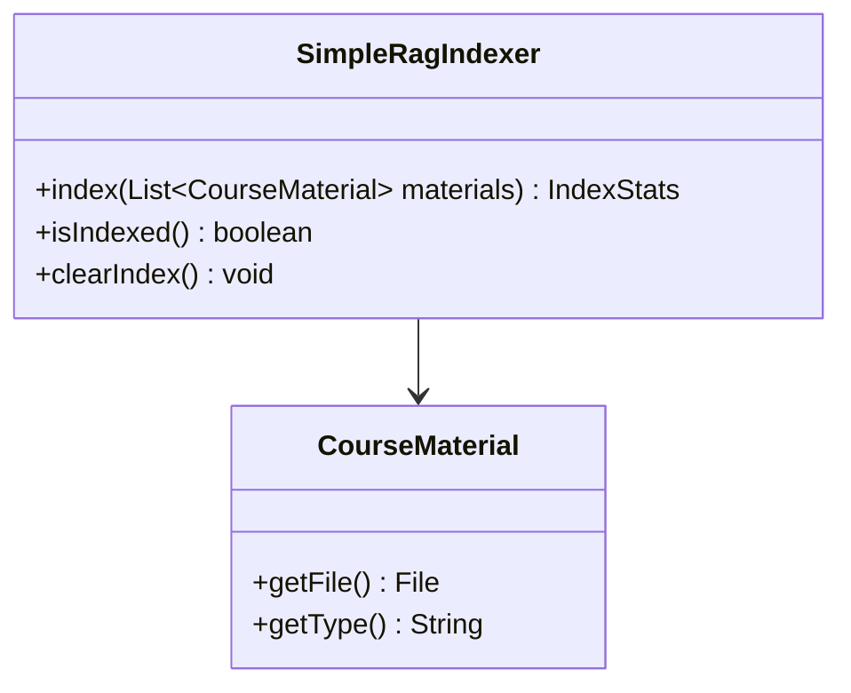

# Rag模块重构说明文档

## 概述

本文档详细说明了Rag模块使用策略模式和管道模式进行重构的设计方案、实现细节和优势。重构旨在提高代码的可维护性、可扩展性和可测试性。

## 重构背景

### 重构前的问题

重构前的Rag模块存在以下问题：

1. **单一职责原则违反**：`SimpleRagIndexer`类承担了过多的职责，包含解析、切分、嵌入、存储等所有功能
2. **扩展性差**：添加新的文件格式或处理策略需要修改现有代码
3. **测试困难**：各个处理阶段耦合紧密，难以进行单元测试
4. **配置不灵活**：处理流程固定，无法根据需求动态调整

### 重构目标

1. **解耦**：将复杂的处理流程拆分为独立的策略和阶段
2. **可扩展**：支持轻松添加新的处理策略和管道阶段
3. **可配置**：支持运行时动态配置处理流程
4. **可测试**：每个策略和阶段都可以独立测试

## 重构方案

### 策略模式应用

将Rag处理过程中的各个步骤抽象为策略接口，实现策略的可插拔性。

### 管道模式应用

将Rag处理流程组织为管道，每个阶段负责特定的处理任务，支持流程的可配置性。

## 重构前后对比

### 重构前类图



## 策略模式优化说明

### 策略模式类图

```mermaid
classDiagram
    class RagIndexer {
        <<interface>>
        +index(List~CourseMaterial~ materials) IndexStats
        +isIndexed() boolean
        +clearIndex() void
    }
    
    class SimpleRagIndexer {
        -StrategySelector strategySelector
        +index(List~CourseMaterial~ materials) IndexStats
        +isIndexed() boolean
        +clearIndex() void
    }
    
    class StrategySelector {
        +selectParser(CourseMaterial) ParserStrategy
        +selectSplitter(String) SplitterStrategy
        +selectEmbedding(String) EmbeddingStrategy
        +selectStorage(String) StorageStrategy
        +registerParserStrategy(ParserStrategy) void
        +registerSplitterStrategy(SplitterStrategy) void
    }
    
    class ParserStrategy {
        <<interface>>
        +parse(CourseMaterial) Document
        +canParse(CourseMaterial) boolean
        +getStrategyName() String
    }
    
    class SplitterStrategy {
        <<interface>>
        +split(Document) List~TextSegment~
        +getStrategyName() String
    }
    
    class EmbeddingStrategy {
        <<interface>>
        +embed(List~TextSegment~) List~Embedding~
        +getStrategyName() String
    }
    
    class StorageStrategy {
        <<interface>>
        +store(List~EmbeddedChunk~) void
        +getStorageSize() int
        +clear() void
        +getStrategyName() String
    }
    
    SimpleRagIndexer ..|> RagIndexer
    SimpleRagIndexer --> StrategySelector
    StrategySelector --> ParserStrategy
    StrategySelector --> SplitterStrategy
    StrategySelector --> EmbeddingStrategy
    StrategySelector --> StorageStrategy
    
    class PdfParserStrategy {
        +parse(CourseMaterial) Document
        +canParse(CourseMaterial) boolean
        +getStrategyName() String
    }
    
    class TextParserStrategy {
        +parse(CourseMaterial) Document
        +canParse(CourseMaterial) boolean
        +getStrategyName() String
    }
    
    class RecursiveSplitterStrategy {
        +split(Document) List~TextSegment~
        +getStrategyName() String
    }
    
    class SlidingWindowSplitterStrategy {
        +split(Document) List~TextSegment~
        +getStrategyName() String
    }
    
    class AllMiniLmEmbeddingStrategy {
        +embed(List~TextSegment~) List~Embedding~
        +getStrategyName() String
    }
    
    class MockEmbeddingStrategy {
        +embed(List~TextSegment~) List~Embedding~
        +getStrategyName() String
    }
    
    class InMemoryStorageStrategy {
        +store(List~EmbeddedChunk~) void
        +getStorageSize() int
        +clear() void
        +getStrategyName() String
    }
    
    PdfParserStrategy ..|> ParserStrategy
    TextParserStrategy ..|> ParserStrategy
    RecursiveSplitterStrategy ..|> SplitterStrategy
    SlidingWindowSplitterStrategy ..|> SplitterStrategy
    AllMiniLmEmbeddingStrategy ..|> EmbeddingStrategy
    MockEmbeddingStrategy ..|> EmbeddingStrategy
    InMemoryStorageStrategy ..|> StorageStrategy
```



### 策略模式优化效果

1. **职责分离**：将原本集中在SimpleRagIndexer中的处理逻辑拆分为四个独立的策略接口
2. **可扩展性**：通过StrategySelector支持策略的动态注册和选择
3. **可配置性**：可以根据材料类型自动选择合适的解析策略
4. **可测试性**：每个策略都可以独立测试，支持Mock策略用于测试

## 管道模式优化说明

### 管道模式类图


### 管道模式优化效果

1. **流程控制**：将Rag处理流程组织为有序的管道阶段
2. **可配置性**：通过RagPipelineBuilder支持管道的灵活构建
3. **监控能力**：通过PipelineListener实现处理过程的实时监控
4. **错误处理**：支持阶段级别的错误处理和恢复机制
5. **扩展性**：可以轻松添加新的处理阶段或调整阶段顺序

## 核心组件说明

### 策略模式组件

#### 1. 策略接口

- **ParserStrategy**: 解析策略接口，负责将课程材料解析为文档
- **SplitterStrategy**: 切分策略接口，负责将文档切分为文本片段
- **EmbeddingStrategy**: 嵌入策略接口，负责将文本片段转换为向量表示
- **StorageStrategy**: 存储策略接口，负责存储嵌入后的向量

#### 2. 策略实现

- **PdfParserStrategy**: PDF文件解析策略
- **TextParserStrategy**: 文本文件解析策略
- **RecursiveSplitterStrategy**: 递归切分策略
- **SlidingWindowSplitterStrategy**: 滑动窗口切分策略
- **AllMiniLmEmbeddingStrategy**: AllMiniLM嵌入策略
- **MockEmbeddingStrategy**: 模拟嵌入策略（用于测试）
- **InMemoryStorageStrategy**: 内存存储策略

#### 3. 策略选择器 (StrategySelector)

负责根据材料类型或配置选择合适的策略，支持策略的动态注册和选择。

### 管道模式组件

#### 1. 管道阶段 (PipelineStage)

每个管道阶段负责特定的处理任务，支持泛型输入输出类型。

#### 2. 处理管道 (RagProcessingPipeline)

协调各个阶段的执行顺序，支持监听器机制进行状态监控。

#### 3. 管道构建器 (RagPipelineBuilder)

提供流畅的API来构建处理管道，支持阶段的自定义配置。

## 重构优势

### 1. 代码可维护性提升

- **职责分离**：每个策略和阶段只负责单一功能
- **接口清晰**：明确的接口定义，便于理解和维护
- **依赖注入**：通过策略选择器实现依赖注入，降低耦合度

### 2. 扩展性增强

- **策略扩展**：添加新策略只需实现相应接口并注册到选择器
- **管道扩展**：可以轻松添加新的处理阶段或调整阶段顺序
- **配置灵活**：支持运行时动态配置处理流程

### 3. 可测试性改善

- **单元测试**：每个策略和阶段都可以独立测试
- **集成测试**：可以测试特定的策略组合和管道配置
- **模拟测试**：支持使用Mock策略进行测试

### 4. 性能监控

- **监听器机制**：通过PipelineListener监控每个阶段的执行状态
- **性能统计**：可以统计每个阶段的执行时间和资源消耗
- **错误处理**：支持细粒度的错误处理和恢复机制

## 使用示例

### 基本使用

```java
// 创建索引器
RagIndexer indexer = new SimpleRagIndexer();

// 索引材料
IndexStats stats = indexer.index(materials);

// 检索
RagRetriever retriever = new SimpleRagRetriever();
List<RetrievedChunk> results = retriever.search("查询内容");
```

### 自定义配置

```java
// 创建策略选择器
StrategySelector selector = new StrategySelector();

// 注册自定义策略
selector.registerParserStrategy(new CustomParserStrategy());
selector.registerSplitterStrategy(new CustomSplitterStrategy());

// 创建自定义索引器
RagIndexer customIndexer = new SimpleRagIndexer(selector);
```

### 管道配置

```java
// 构建自定义管道
RagProcessingPipeline pipeline = new RagPipelineBuilder()
    .withParserStrategy(parser)
    .withSplitterStrategy(splitter)
    .withEmbeddingStrategy(embedding)
    .withStorageStrategy(storage)
    .withListener(listener)
    .build();
```

## 文件结构变化

### 重构前结构

```
rag/
├── RagIndexer.java
├── RagRetriever.java
├── CourseMaterial.java
└── impl/
    └── SimpleRagIndexer.java
```

### 重构后结构

```
rag/
├── RagIndexer.java
├── RagRetriever.java
├── CourseMaterial.java
├── strategy/           # 策略模式相关
│   ├── ParserStrategy.java
│   ├── SplitterStrategy.java
│   ├── EmbeddingStrategy.java
│   ├── StorageStrategy.java
│   └── impl/          # 策略实现
│       ├── PdfParserStrategy.java
│       ├── TextParserStrategy.java
│       └── ...
├── pipeline/          # 管道模式相关
│   ├── RagProcessingPipeline.java
│   ├── PipelineStage.java
│   ├── RagPipelineBuilder.java
│   └── stages/        # 管道阶段实现
│       ├── ParsingStage.java
│       ├── SplittingStage.java
│       └── ...
└── impl/
    └── SimpleRagIndexer.java
```

## 性能影响分析

### 性能优势

1. **并行处理**：管道模式支持阶段的并行执行
2. **资源复用**：策略实例可以复用，减少对象创建开销
3. **缓存优化**：可以针对不同策略实现特定的缓存机制

### 性能开销

1. **对象创建**：策略选择和管道构建需要额外的对象创建
2. **方法调用**：策略模式增加了方法调用的层次
3. **内存占用**：需要维护策略和管道的状态信息

## 总结

通过策略模式和管道模式的重构，Rag模块实现了以下改进：

1. **架构清晰**：职责分离，接口明确
2. **扩展灵活**：支持策略和管道的动态配置
3. **测试友好**：支持单元测试和集成测试
4. **维护简单**：代码结构清晰，易于理解和修改

重构后的Rag模块不仅满足了当前的需求，还为未来的功能扩展奠定了良好的基础。