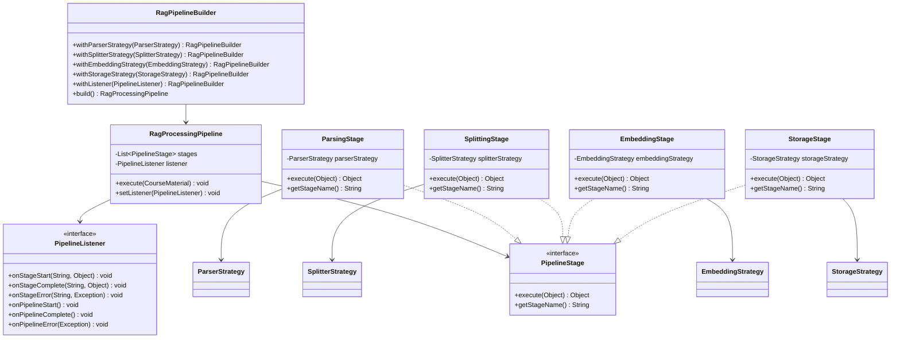

# Rag模块重构说明文档

## 概述

Rag模块使用策略模式和管道模式进行重构。下面是有关重构设计方案、实现细节和优势的说明，旨在提高代码的可维护性、可扩展性和可测试性。

## 重构背景

### 重构前的问题

重构前的Rag模块存在以下问题：

1. **单一职责原则违反**：`SimpleRagIndexer`类承担了过多的职责，包含解析、切分、嵌入、存储等所有功能
2. **扩展性差**：添加新的文件格式或处理策略需要修改现有代码
3. **测试困难**：各个处理阶段耦合紧密，难以进行单元测试
4. **配置不灵活**：处理流程固定，无法根据需求动态调整

### 重构目标

1. **解耦**：将复杂的处理流程拆分为独立的策略和阶段
2. **可扩展**：支持轻松添加新的处理策略和管道阶段
3. **可配置**：支持运行时动态配置处理流程
4. **可测试**：每个策略和阶段都可以独立测试

## 重构方案

### 策略模式应用

将Rag处理过程中的各个步骤抽象为策略接口，实现策略的可插拔性。
将之前的全部耦合在一起的文档解析策略，文档切分策略，嵌入模型策略，存储策略解耦，每个策略都有自己的接口和实现类。

### 管道模式应用

将Rag处理流程组织为管道，每个阶段负责特定的处理任务，支持流程的可配置性。

## 重构前后对比

### 重构前类图


### 重构前代码示例

以下展示重构前的`SimpleRagIndexer`类，所有功能都耦合在一个类中

;

```java
// 重构前的SimpleRagIndexer类 - 所有功能耦合在一起
private static final InMemoryEmbeddingStore<TextSegment> EMBEDDING_STORE = new InMemoryEmbeddingStore<>();
private static final Path INDEX_FILE_PATH = Paths.get("rag_materials_meta.json");
    static {
        // Load from persistent file if exists
        if (Files.exists(INDEX_FILE_PATH)) {
            try {
                String json = Files.readString(INDEX_FILE_PATH);
                if (!json.isEmpty()) {
                    InMemoryEmbeddingStore.fromJson(json);
                }
            } catch (IOException e) {
                LOG.error("Failed to load index from file", e);
            }
        }
    }

/**
 * Creates an instance of AllMiniLmL6V2QuantizedEmbeddingModel
 *
 * @return the embedding model instance
 */
private static EmbeddingModel createEmbeddingModel() {
    ClassLoader cl = SimpleRagIndexer.class.getClassLoader();
    ClassLoader original = Thread.currentThread().getContextClassLoader();
    try {
        Thread.currentThread().setContextClassLoader(cl);
        return new AllMiniLmL6V2QuantizedEmbeddingModel();
    } finally {
        Thread.currentThread().setContextClassLoader(original);
    }
}

/**
 * Indexes a list of course materials
 *
 * @param materials the list of course materials to index
 * @return indexing statistics
 */
@Override
public IndexStats index(List<CourseMaterial> materials) {
    LOG.info("index materials：" + materials.size());

    long startTime = System.currentTimeMillis();

    List<TextSegment> allSegments = new ArrayList<>();
    for (CourseMaterial material : materials) {
        Path path = material.getFile().toPath();
        String fileName = material.getFile().getName();
        List<TextSegment> segments = parseAndSplit(material, path, fileName);
        allSegments.addAll(segments);
    }

    EmbeddingModel embeddingModel = createEmbeddingModel();
    List<Embedding> embeddings = embeddingModel.embedAll(allSegments).content();

    EMBEDDING_STORE.removeAll();
    EMBEDDING_STORE.addAll(embeddings, allSegments);

    // Persist to file
    try {
        Files.writeString(INDEX_FILE_PATH, EMBEDDING_STORE.serializeToJson());
    } catch (IOException e) {
        LOG.error("Failed to save index to file", e);
    }

    long indexingTime = System.currentTimeMillis() - startTime;

    return new IndexStats(materials.size(), allSegments.size(), indexingTime);
}

/**
 * Parses and splits course materials into text segments
 *
 * @param material the course material
 * @param path the file path
 * @param fileName the file name
 * @return list of text segments
 */
private List<TextSegment> parseAndSplit(CourseMaterial material, Path path, String fileName) {
    List<TextSegment> segments = new ArrayList<>();
    CourseMaterial.MaterialType type = material.getType();
    DocumentSplitter splitter = DocumentSplitters.recursive(500, 100); // 100 characters overlap allowed

    try {
        switch (type) {
            case PDF:
                try (PDDocument pdfDocument = PDDocument.load(material.getFile())) {
                    PDFTextStripper stripper = new PDFTextStripper();
                    for (int page = 1; page <= pdfDocument.getNumberOfPages(); page++) {
                        stripper.setStartPage(page);
                        stripper.setEndPage(page);
                        String pageText = stripper.getText(pdfDocument);
                        if (!pageText.trim().isEmpty()) {
                            Document pageDoc = new Document(pageText);
                            List<TextSegment> pageSegments = splitter.split(pageDoc);
                            for (TextSegment seg : pageSegments) {
                                Metadata metadata = seg.metadata()
                                        .add("file_name", fileName)
                                        .add("page_number", page)
                                        .add("page_range", page + "-" + page);
                                segments.add(TextSegment.from(seg.text(), metadata));
                            }
                        }
                    }
                }
                break;
            case TEXT:
                Document textDoc = loadDocument(path, new TextDocumentParser());
                List<TextSegment> textSegments = splitter.split(textDoc);
                for (TextSegment seg : textSegments) {
                    Metadata metadata = seg.metadata()
                            .add("file_name", fileName)
                            .add("page_number", 1)
                            .add("page_range", "1-1");
                    segments.add(TextSegment.from(seg.text(), metadata));
                }
                break;
            default:
                throw new IllegalArgumentException("Unsupported material type: " + type);
        }
    } catch (IOException e) {
        LOG.error("Failed to parse document: " + fileName, e);
    }

    return segments;
}
```


## 策略模式优化说明

### 策略模式类图


### 策略模式代码示例

以下展示使用策略模式重构后的代码结构：

```java
// 重构后的SimpleRagIndexer使用策略模式
public class SimpleRagIndexer implements RagIndexer {
private StrategySelector strategySelector;

    public SimpleRagIndexer(StrategySelector selector) {
        this.strategySelector = selector;
    }
    
    @Override
    public IndexStats index(List materials) {
        IndexStats stats = new IndexStats();
        
        for (CourseMaterial material : materials) {
            // 1. 选择并执行解析策略
            ParserStrategy parser = strategySelector.selectParser(material);
            Document document = parser.parse(material);
            stats.documentsProcessed++;
            
            // 2. 选择并执行切分策略
            SplitterStrategy splitter = strategySelector.selectSplitter("recursive");
            List segments = splitter.split(document);
            stats.segmentsGenerated += segments.size();
            
            // 3. 选择并执行嵌入策略
            EmbeddingStrategy embedder = strategySelector.selectEmbedding("all-minilm");
            List embeddings = embedder.embed(segments);
            
            // 4. 选择并执行存储策略
            StorageStrategy storage = strategySelector.selectStorage("memory");
            List chunks = createEmbeddedChunks(embeddings, segments, material);
            storage.store(chunks);
        }
        
        return stats;
    }
    
    private List createEmbeddedChunks(List embeddings, 
                                                    List segments, 
                                                    CourseMaterial material) {
        // 创建嵌入块逻辑
        return new ArrayList<>();
    }
}
```

### 策略模式优化效果

1. **职责分离**：将原本集中在SimpleRagIndexer中的处理逻辑拆分为四个独立的策略接口
2. **可扩展性**：通过StrategySelector支持策略的动态注册和选择
3. **可配置性**：可以根据材料类型自动选择合适的解析策略

## 管道模式优化说明

### 管道模式类图


### 管道模式代码示例

以下展示使用管道模式重构后的代码结构：

```java
    public static void main(String[] args) {
        RagPipelineBuilder builder = new RagPipelineBuilder()
            .withParserStrategy(new PdfParserStrategy())
            .withSplitterStrategy(new RecursiveSplitterStrategy())
            .withEmbeddingStrategy(new AllMiniLmEmbeddingStrategy())
            .withStorageStrategy(new InMemoryStorageStrategy())
            .withListener(new LoggingPipelineListener());
            
        RagIndexer indexer = new PipelineRagIndexer(builder);
        IndexStats stats = indexer.index(materials);
    }
```

### 管道模式优化效果

1. **流程控制**：将Rag处理流程组织为有序的管道阶段
2  **扩展性**：可以轻松添加新的处理阶段或调整阶段顺序

## 核心组件说明

### 策略模式组件

#### 1. 策略接口

- **ParserStrategy**: 解析策略接口，负责将课程材料解析为文档
- **SplitterStrategy**: 切分策略接口，负责将文档切分为文本片段
- **EmbeddingStrategy**: 嵌入策略接口，负责将文本片段转换为向量表示
- **StorageStrategy**: 存储策略接口，负责存储嵌入后的向量

#### 2. 策略实现

- **PdfParserStrategy**: PDF文件解析策略
- **TextParserStrategy**: 文本文件解析策略
- **RecursiveSplitterStrategy**: 递归切分策略
- **SlidingWindowSplitterStrategy**: 滑动窗口切分策略
- **AllMiniLmEmbeddingStrategy**: AllMiniLM嵌入策略
- **InMemoryStorageStrategy**: 内存存储策略

#### 3. 策略选择器 (StrategySelector)

负责根据材料类型或配置选择合适的策略，支持策略的动态注册和选择。

### 管道模式组件

#### 1. 管道阶段 (PipelineStage)

每个管道阶段负责特定的处理任务，支持泛型输入输出类型。

#### 2. 处理管道 (RagProcessingPipeline)

协调各个阶段的执行顺序，支持监听器机制进行状态监控。

## 重构优势

### 1. 代码可维护性提升

- **职责分离**：每个策略和阶段只负责单一功能
- **接口清晰**：明确的接口定义，便于理解和维护

### 2. 扩展性增强

- **策略扩展**：添加新策略只需实现相应接口并注册到选择器
- **管道扩展**：可以轻松添加新的处理阶段或调整阶段顺序

### 3. 可测试性改善

- **单元测试**：每个策略和阶段都可以独立测试

## 总结

通过策略模式和管道模式的重构，Rag模块实现了以下改进：

1. **架构清晰**：职责分离，接口明确
2. **扩展灵活**：支持策略和管道的动态配置
3. **测试友好**：支持单元测试和集成测试
4. **维护简单**：代码结构清晰，易于理解和修改

重构后的Rag模块不仅满足了当前的需求，还为未来的功能扩展奠定了良好的基础。